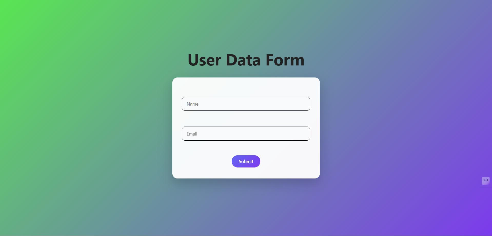
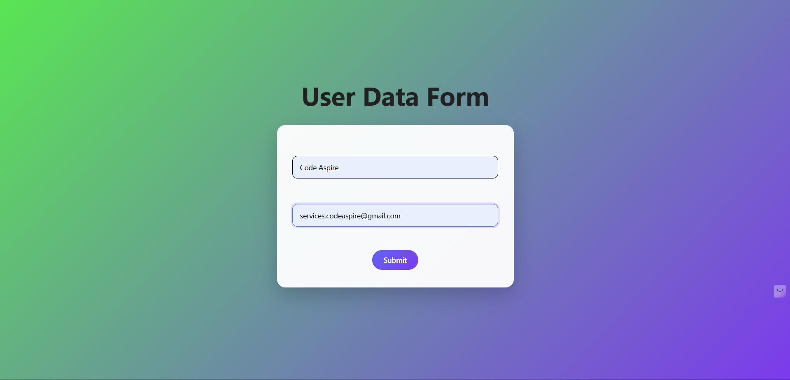
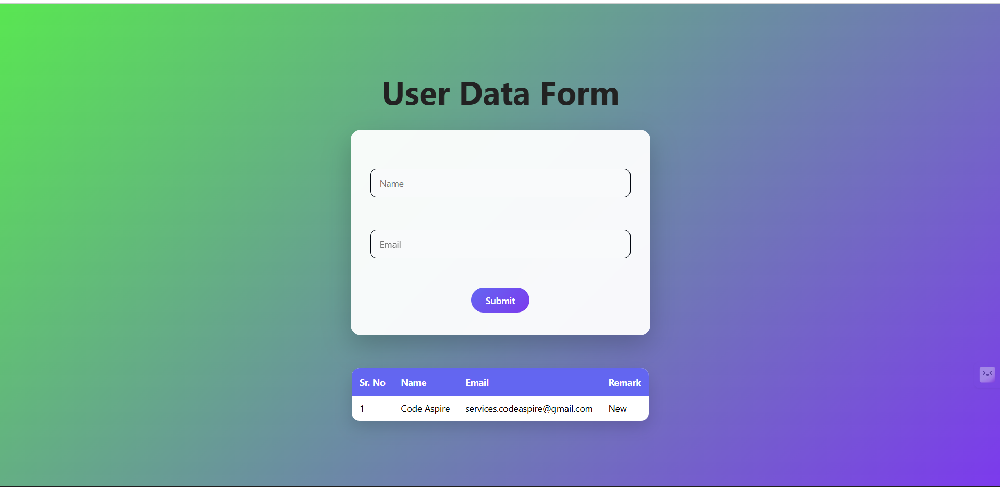
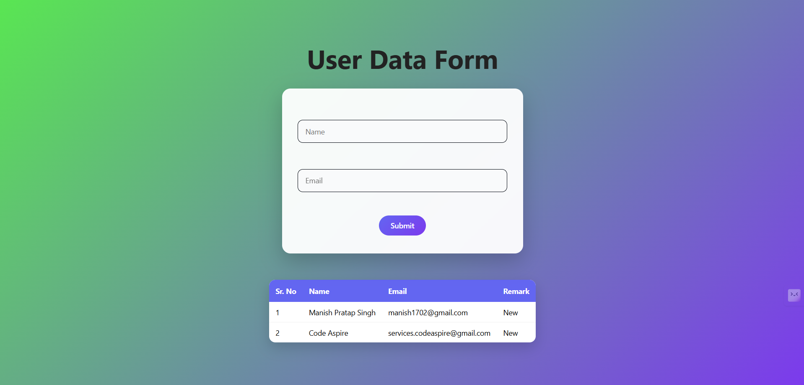

# User Data Form (Full Stack Project)

A simple full-stack application that collects user data through a form and displays submissions in a dynamic table. Data is stored temporarily in server memory and resets when the server restarts.

## 🛠️ Tech Stack

**Frontend:**

* HTML
* CSS (using AI(GPT))
* JavaScript (Vanilla JS)

**Backend:**

* Node.js
* Express.js

---

## 📁 Project Structure

```
project/
│
├── server/
│   └── server.js
│
├── client/
│   ├── index.html
│   ├── style.css
│   └── style.js
│
└── README.md
```

---

## ⚙️ Installation & Setup

### 1. Clone the repository

```bash
git clone <your-repo-url>
cd project
```

### 2. Install dependencies

```bash
npm install
```

### 3. Run the server

```bash
node server.js
```

Server will start at:

```
http://localhost:3000
```

### 4. Open frontend

Open `index.html` in your browser.

enter name and email id (both are required)
then hit enter or press submit button

result : you will see a table containing
names and emails of all users.

---


## 🧠 How It Works

* User submits form → frontend sends POST request
* Server stores data in an array (`users[]`)
* Frontend fetches updated data using GET request
* Table dynamically updates with latest entry on top

---

## Screen Shots






## 👨‍💻 Author

Manish

---

## ⭐ Feel free to enhance this project and make it production-ready!

